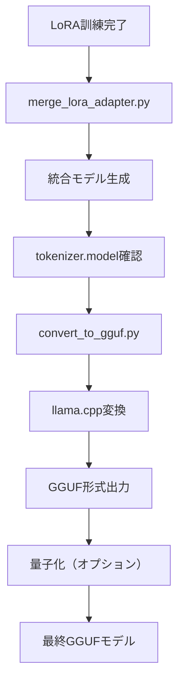

# LoRA (Low-Rank Adaptation) 詳細ガイド

このドキュメントでは、LoRA（Low-Rank Adaptation）の仕組み、パラメータの設定方法、およびファインチューニングへの影響について詳しく解説します。

## 目次

1. [LoRAとは](#loraとは)
2. [LoRAの仕組み](#loraの仕組み)
3. [LoRAパラメータ詳細](#loraパラメータ詳細)
4. [パラメータ設定ガイド](#パラメータ設定ガイド)
5. [Adapterの仕組み](#adapterの仕組み)
6. [マージ処理の詳細](#マージ処理の詳細)
7. [GGUF変換プロセス](#gguf変換プロセス)
8. [実践的な設定例](#実践的な設定例)
9. [トラブルシューティング](#トラブルシューティング)

## LoRAとは

**LoRA (Low-Rank Adaptation)** は、大規模言語モデルを効率的にファインチューニングするための手法です。

### 従来のファインチューニングの問題点

```
従来の方法:
- 全パラメータを更新 → 大量のメモリとストレージが必要
- GPT-3.5: 175B パラメータ → 175B個すべてを調整
- メモリ使用量: 数百GB〜数TB
```

### LoRAの解決策

```
LoRAの方法:
- 低ランク行列で近似 → 少数のパラメータのみ更新
- GPT-3.5: 175B パラメータ → 数百万〜数千万個のみ調整
- メモリ使用量: 数GB〜数十GB
```

## LoRAの仕組み

### 数学的な基盤

LoRAは、重み行列の更新を低ランク行列の積で近似します：

```
元の重み行列: W ∈ R^(d×k)
更新後の重み: W' = W + ΔW

LoRAでは:
ΔW = A × B
ここで A ∈ R^(d×r), B ∈ R^(r×k), r << min(d,k)
```

### 視覚的な説明

```
従来のファインチューニング:
┌─────────────────┐
│   Original W    │  ← 全体を更新
│   (d × k)       │
└─────────────────┘

LoRA:
┌─────────────────┐    ┌──────┐   ┌──────────┐
│   Original W    │ +  │  A   │ × │    B     │
│   (d × k)       │    │(d×r) │   │  (r×k)   │
│   (frozen)      │    └──────┘   └──────────┘
└─────────────────┘       ↑
                      少数パラメータのみ更新
```

### Transformerモデルでの適用

#### LoRAの実装詳細

```python
# Attention層への適用例
class LoRALinear:
    def __init__(self, original_linear, r, alpha):
        self.original = original_linear  # 凍結
        self.lora_A = nn.Linear(in_features, r, bias=False)
        self.lora_B = nn.Linear(r, out_features, bias=False)
        self.scaling = alpha / r
        
        # 重み初期化
        nn.init.kaiming_uniform_(self.lora_A.weight, a=math.sqrt(5))
        nn.init.zeros_(self.lora_B.weight)  # Bは0で初期化
        
    def forward(self, x):
        original_output = self.original(x)
        lora_output = self.lora_B(self.lora_A(x)) * self.scaling
        return original_output + lora_output
```

#### LoRA適用の処理フロー

```python
# train_lora.pyでの処理フロー

def apply_lora_to_model(model, lora_config):
    # 1. ターゲットモジュールの特定
    target_modules = ["q_proj", "v_proj", "k_proj", "o_proj"]
    
    # 2. 各層にLoRAを適用
    for name, module in model.named_modules():
        if any(target in name for target in target_modules):
            # 元の重みを凍結
            for param in module.parameters():
                param.requires_grad = False
            
            # LoRA層を追加
            lora_layer = LoRALinear(module, r=16, alpha=32)
            setattr(model, name, lora_layer)
    
    # 3. 訓練可能パラメータの確認
    total_params = sum(p.numel() for p in model.parameters())
    trainable_params = sum(p.numel() for p in model.parameters() if p.requires_grad)
    
    print(f"Total: {total_params}, Trainable: {trainable_params}")
    print(f"Trainable ratio: {100 * trainable_params / total_params:.2f}%")
```

#### Attention機構でのLoRA

```python
# Multi-Head Attentionでの具体例
class MultiHeadAttentionWithLoRA:
    def __init__(self, d_model=1152, n_heads=4, r=16, alpha=32):
        self.d_model = d_model
        self.n_heads = n_heads
        self.head_dim = d_model // n_heads
        
        # 元のProjection層（凍結）
        self.q_proj = nn.Linear(d_model, d_model, bias=False)
        self.k_proj = nn.Linear(d_model, d_model, bias=False)
        self.v_proj = nn.Linear(d_model, d_model, bias=False)
        self.o_proj = nn.Linear(d_model, d_model, bias=False)
        
        # LoRA層
        self.q_lora = LoRALinear(self.q_proj, r, alpha)
        self.k_lora = LoRALinear(self.k_proj, r, alpha)
        self.v_lora = LoRALinear(self.v_proj, r, alpha)
        self.o_lora = LoRALinear(self.o_proj, r, alpha)
    
    def forward(self, x):
        batch_size, seq_len, d_model = x.shape
        
        # LoRA適用済みのProjection
        Q = self.q_lora(x)  # 元の重み + LoRA調整
        K = self.k_lora(x)
        V = self.v_lora(x)
        
        # Multi-Head Attention計算
        Q = Q.view(batch_size, seq_len, self.n_heads, self.head_dim).transpose(1, 2)
        K = K.view(batch_size, seq_len, self.n_heads, self.head_dim).transpose(1, 2)
        V = V.view(batch_size, seq_len, self.n_heads, self.head_dim).transpose(1, 2)
        
        attention_output = self.compute_attention(Q, K, V)
        output = self.o_lora(attention_output)
        
        return output
```

#### LoRA訓練の詳細過程

```python
# 訓練ループでの処理
def train_lora_step(model, batch, optimizer):
    # 1. Forward pass
    input_ids = batch['input_ids']
    labels = batch['labels']
    
    # 元のモデル出力（勾配なし）
    with torch.no_grad():
        base_logits = original_model(input_ids).logits
    
    # LoRA適用モデルの出力
    lora_logits = model(input_ids).logits
    
    # 2. Loss計算
    loss = F.cross_entropy(lora_logits.view(-1, vocab_size), labels.view(-1))
    
    # 3. Backward pass（LoRAパラメータのみ）
    loss.backward()
    
    # 4. 勾配確認
    for name, param in model.named_parameters():
        if param.requires_grad and param.grad is not None:
            print(f"LoRA gradient: {name}, norm: {param.grad.norm()}")
    
    # 5. パラメータ更新
    optimizer.step()
    optimizer.zero_grad()
    
    return loss.item()
```

#### メモリ効率の実現

```python
# メモリ使用量の比較
def memory_comparison():
    """
    従来のファインチューニング:
    - 全パラメータの勾配: 1.3B × 4 bytes = 5.2GB
    - オプティマイザ状態: 1.3B × 8 bytes = 10.4GB
    - 合計: ~15.6GB
    
    LoRA (r=16):
    - LoRAパラメータ: ~73M parameters
    - 勾配: 73M × 4 bytes = 292MB
    - オプティマイザ状態: 73M × 8 bytes = 584MB
    - 合計: ~876MB (約94%削減)
    """
    pass
```

## LoRAパラメータ詳細

### 1. ランク (r) - 最重要パラメータ

**定義**: 低ランク行列の次元数

```python
# train_lora.pyでの設定
--lora-r 16  # デフォルト値
```

**影響**:
- **小さい値 (r=4-8)**: 
  - ✅ メモリ効率が良い
  - ✅ 高速訓練
  - ❌ 表現力が限定的
  - 📊 適用例: 簡単なタスク、リソース制約環境

- **中程度 (r=16-32)**:
  - ⚖️ バランスが良い
  - 📊 適用例: 一般的なファインチューニング

- **大きい値 (r=64-128)**:
  - ✅ 高い表現力
  - ❌ メモリ使用量増加
  - ❌ 訓練時間増加
  - 📊 適用例: 複雑なタスク、大規模データセット

**計算例**:
```
Gemma 3-1B の query_proj層 (1152 → 1152):
- 元のパラメータ数: 1152 × 1152 = 1,327,104
- LoRA r=16: (1152×16) + (16×1152) = 36,864 (約2.8%のパラメータ)
- LoRA r=32: (1152×32) + (32×1152) = 73,728 (約5.6%のパラメータ)
```

### 2. アルファ (α) - スケーリング係数

**定義**: LoRA出力のスケーリング係数

```python
# train_lora.pyでの設定
--lora-alpha 32  # デフォルト値
```

**数学的役割**:
```
最終出力 = 元の出力 + (α/r) × LoRA出力
スケーリング = α/r
```

**影響**:
- **α < r (例: α=8, r=16)**:
  - スケーリング = 0.5
  - LoRAの影響を抑制
  - 安定した学習、変化が緩やか

- **α = r (例: α=16, r=16)**:
  - スケーリング = 1.0
  - バランスの取れた影響

- **α > r (例: α=32, r=16)**:
  - スケーリング = 2.0
  - LoRAの影響を強化
  - より大きな変化、学習率に注意

**実践的な設定**:
```python
# 保守的な設定（安定重視）
r=16, alpha=16  # scaling=1.0

# 標準的な設定
r=16, alpha=32  # scaling=2.0

# アグレッシブな設定（大きな変化を期待）
r=16, alpha=64  # scaling=4.0
```

### 3. ドロップアウト (dropout)

**定義**: 過学習防止のための正則化手法

```python
# train_lora.pyでの設定
--lora-dropout 0.05  # デフォルト値 (5%)
```

**影響**:
- **0.0 (ドロップアウトなし)**:
  - 最大の学習能力
  - 過学習のリスク

- **0.05-0.1 (軽い正則化)**:
  - バランスの取れた学習
  - 一般的な設定

- **0.2-0.3 (強い正則化)**:
  - 過学習を強く抑制
  - 学習能力が制限される可能性

### 4. ターゲットモジュール (target_modules)

**定義**: LoRAを適用する層の指定

```python
# 本プロジェクトでの設定例
target_modules = [
    # Attention層（必須）
    "q_proj", "v_proj", "k_proj", "o_proj",
    # FFN層（口調学習に重要）
    "gate_proj", "up_proj", "down_proj"
]
```

**各モジュールの役割**:

1. **Attention層**:
   - `q_proj` (Query): 質問の生成
   - `k_proj` (Key): キーの生成
   - `v_proj` (Value): 値の生成
   - `o_proj` (Output): 出力の結合

2. **FFN層 (Feed Forward Network)**:
   - `gate_proj`: ゲート機構
   - `up_proj`: 次元拡張
   - `down_proj`: 次元縮小

**適用パターン**:
```python
# 最小限（メモリ効率重視）
target_modules = ["q_proj", "v_proj"]

# 標準（推奨）
target_modules = ["q_proj", "v_proj", "k_proj", "o_proj"]

# 最大限（性能重視）
target_modules = [
    "q_proj", "v_proj", "k_proj", "o_proj",
    "gate_proj", "up_proj", "down_proj"
]
```

## パラメータ設定ガイド

### タスク別推奨設定

#### 1. 対話・チャットボット
```bash
python scripts/train_lora.py \
  --model google/gemma-3-1b-it \
  --lora-r 16 \
  --lora-alpha 32 \
  --lora-dropout 0.05 \
  --learning-rate 5e-5
```

**理由**: バランスの取れた設定で自然な対話を学習

#### 2. 特定ドメインの専門知識
```bash
python scripts/train_lora.py \
  --model google/gemma-3-1b-it \
  --lora-r 32 \
  --lora-alpha 64 \
  --lora-dropout 0.1 \
  --learning-rate 3e-5
```

**理由**: 高いランクで複雑な知識を学習、ドロップアウトで過学習防止

#### 3. コード生成・プログラミング
```bash
python scripts/train_lora.py \
  --model google/gemma-3-1b-it \
  --lora-r 24 \
  --lora-alpha 48 \
  --lora-dropout 0.05 \
  --learning-rate 2e-5
```

**理由**: 構造化された出力に対応、低い学習率で安定学習

#### 4. 言語スタイル・口調の変更
```bash
python scripts/train_lora.py \
  --model google/gemma-3-1b-it \
  --lora-r 8 \
  --lora-alpha 16 \
  --lora-dropout 0.05 \
  --learning-rate 1e-4
```

**理由**: 低ランクでも効果的、FFN層が重要

### データサイズ別推奨設定

| データサイズ | r | α | dropout | 学習率 | 理由 |
|-------------|---|---|---------|--------|------|
| 小 (< 1K例) | 8 | 16 | 0.1 | 1e-4 | 過学習防止 |
| 中 (1K-10K) | 16 | 32 | 0.05 | 5e-5 | バランス |
| 大 (> 10K) | 32 | 64 | 0.05 | 2e-5 | 高表現力 |

### リソース制約別推奨設定

#### メモリ制約環境 (< 8GB VRAM)
```bash
--lora-r 4 --lora-alpha 8 --batch-size 1 --gradient-accumulation-steps 16
```

#### 標準環境 (8-16GB VRAM)
```bash
--lora-r 16 --lora-alpha 32 --batch-size 2 --gradient-accumulation-steps 8
```

#### 高性能環境 (> 16GB VRAM)
```bash
--lora-r 32 --lora-alpha 64 --batch-size 4 --gradient-accumulation-steps 4
```

## Adapterの仕組み

### LoRAアダプターの構造

```
model/
├── adapter_config.json     # LoRA設定
├── adapter_model.safetensors  # LoRA重み
├── tokenizer.json         # トークナイザー設定
├── tokenizer_config.json  # トークナイザー設定
└── training_info.json     # 訓練情報
```

### adapter_config.json の内容例

```json
{
  "alpha": 32,
  "auto_mapping": null,
  "base_model_name_or_path": "google/gemma-3-1b-it",
  "bias": "none",
  "fan_in_fan_out": false,
  "inference_mode": true,
  "init_lora_weights": true,
  "layers_pattern": null,
  "layers_to_transform": null,
  "lora_dropout": 0.05,
  "modules_to_save": null,
  "peft_type": "LORA",
  "r": 16,
  "rank_pattern": {},
  "revision": null,
  "target_modules": [
    "q_proj",
    "v_proj",
    "k_proj",
    "o_proj",
    "gate_proj",
    "up_proj",
    "down_proj"
  ],
  "task_type": "CAUSAL_LM"
}
```

### アダプターの読み込み過程

```python
# 1. ベースモデルの読み込み
base_model = AutoModelForCausalLM.from_pretrained("google/gemma-3-1b-it")

# 2. LoRAアダプターの適用
model = PeftModel.from_pretrained(base_model, "path/to/adapter")

# 3. 内部での処理
# - adapter_config.jsonを読み込み
# - LoRA層を元のモデルに注入
# - 元の重みは凍結、LoRA重みのみアクティブ
```

### アダプターのマージ

```python
# アダプターをベースモデルにマージ
merged_model = model.merge_and_unload()

# マージ後の状態:
# W_new = W_original + (alpha/r) * A * B
```

### 複数アダプターの管理

```python
# 異なるタスク用のアダプター
model.load_adapter("path/to/chat_adapter", adapter_name="chat")
model.load_adapter("path/to/code_adapter", adapter_name="code")

# アダプターの切り替え
model.set_adapter("chat")    # チャット用
model.set_adapter("code")    # コード生成用
```

## マージ処理の詳細

### マージとは何か

**マージ処理**は、LoRAアダプターの重みをベースモデルの重みに統合する処理です。これにより、単一のモデルファイルとして扱えるようになります。

### マージの数学的仕組み

```python
# マージ前の状態
W_base = 元のモデルの重み行列
A, B = LoRAアダプターの重み行列
alpha, r = LoRAパラメータ

# マージ処理
W_merged = W_base + (alpha / r) × A × B

# マージ後
# - 単一の重み行列として統合
# - LoRAアダプターファイルは不要になる
# - 推論時の計算が高速化
```

### マージのメリット・デメリット

#### ✅ メリット
1. **推論高速化**:
   - LoRA計算のオーバーヘッドがなくなる
   - 単一の行列乗算で済む

2. **ファイル管理の簡素化**:
   - ベースモデル + アダプター → 単一モデル
   - デプロイが簡単

3. **GGUF変換の前提**:
   - llama.cppは分離されたLoRAアダプターを直接サポートしない
   - 統合されたモデルが必要

#### ❌ デメリット
1. **柔軟性の喪失**:
   - 複数アダプターの切り替えができない
   - タスク固有の最適化が困難

2. **ストレージ使用量**:
   - ベースモデルサイズ分のディスク容量が必要
   - アダプター（数MB〜数百MB）→ 統合モデル（数GB）

### マージ処理の実装詳細

```python
# merge_lora_adapter.pyでの処理フロー

def merge_process():
    # 1. ベースモデル読み込み
    base_model = AutoModelForCausalLM.from_pretrained("google/gemma-3-1b-it")
    
    # 2. LoRAアダプター適用
    model = PeftModel.from_pretrained(base_model, "path/to/lora_adapter")
    
    # 3. マージ実行
    merged_model = model.merge_and_unload()
    # 内部処理:
    # for name, module in model.named_modules():
    #     if hasattr(module, 'merge'):
    #         module.merge()  # W = W + alpha/r * A * B
    
    # 4. 統合モデル保存
    merged_model.save_pretrained("output/merged_model")
```

### マージ時の注意点

1. **メモリ使用量**:
   ```python
   # マージ中は一時的にメモリ使用量が増加
   # ベースモデル + LoRAアダプター + マージ後モデル
   # 合計: 通常の2-3倍のメモリが必要
   ```

2. **精度の確認**:
   ```python
   # マージ前後での出力比較
   original_output = model.generate(input_ids)
   merged_output = merged_model.generate(input_ids)
   # 結果は理論上同一になるはず
   ```

## GGUF変換プロセス

### GGUF変換の必要性

**GGUF (GPT-Generated Unified Format)** は、llama.cppで使用される高効率なモデル形式です。

#### なぜGGUF変換が必要か

1. **推論速度の向上**:
   - CPU最適化: SIMD命令セットの活用
   - メモリアクセス最適化: 連続的なメモリレイアウト
   - 量子化サポート: INT4, INT8での高速計算

2. **メモリ効率**:
   ```
   HuggingFace形式 (PyTorch):
   - Gemma 3-1B: ~2.6GB (float16)
   - メモリ使用量: ~4-6GB (推論時)
   
   GGUF形式 (量子化):
   - Gemma 3-1B Q4_K_M: ~800MB
   - メモリ使用量: ~1-2GB (推論時)
   ```

3. **プラットフォーム対応**:
   - CPU専用環境での実行
   - GPU不要での高速推論
   - エッジデバイス対応

### マージが変換前に必要な理由

#### 技術的制約

```
llama.cpp の制約:
1. 統合されたモデル重みを期待
2. 動的なLoRA計算をサポートしない
3. 単一のGGUFファイルにすべての重みを格納
```

#### 処理フローの比較

**❌ 不可能なフロー**:
```
ベースモデル(HF) + LoRAアダプター → GGUF変換
                                    ↑
                              llama.cppが理解できない
```

**✅ 正しいフロー**:
```
ベースモデル(HF) + LoRAアダプター → マージ → 統合モデル(HF) → GGUF変換
```

### GGUF変換の処理詳細

#### 1. tokenizer.model自動生成

```python
# convert_to_gguf.pyでの処理
def ensure_tokenizer_model(model_path):
    tokenizer_model_path = Path(model_path) / "tokenizer.model"
    
    if not tokenizer_model_path.exists():
        # HuggingFaceキャッシュから取得
        original_model = cached_file(base_model_name, "tokenizer.model")
        shutil.copy2(original_model, tokenizer_model_path)
```

**必要性**:
- llama.cppはSentencePieceトークナイザーを期待
- HuggingFace形式のみでは不十分
- tokenizer.modelファイルが必須

#### 2. llama.cpp変換スクリプト実行

```bash
# 実際の変換コマンド
python llama.cpp/convert_hf_to_gguf.py \
  /path/to/merged_model \
  --outfile /path/to/output.gguf \
  --outtype f16
```

**内部処理**:
1. モデルアーキテクチャの検出
2. 重み行列の抽出とフォーマット変換
3. メタデータの埋め込み
4. GGUFファイル形式での出力

#### 3. 量子化（オプション）

```bash
# 変換後の量子化
llama.cpp/build/bin/llama-quantize \
  model.gguf \
  model_q4.gguf \
  Q4_K_M
```

**量子化方式**:
```python
量子化オプション:
- Q4_K_M: 4bit、高品質（推奨）
- Q5_K_M: 5bit、最高品質
- Q8_0: 8bit、精度重視
- Q2_K: 2bit、最小サイズ
```

### 変換プロセス全体の流れ



### 変換時の注意点

1. **ディスク容量**:
   ```
   必要容量の目安:
   - 元モデル: 2.6GB
   - 統合モデル: 2.6GB
   - GGUF形式: 2.6GB (f16) or 800MB (Q4_K_M)
   - 一時的に最大8GB程度必要
   ```

2. **変換時間**:
   ```
   Gemma 3-1Bの場合:
   - マージ: 1-2分
   - GGUF変換: 2-5分
   - 量子化: 1-3分
   ```

3. **精度検証**:
   ```python
   # 変換前後での出力比較
   hf_output = merged_model.generate(test_input)
   gguf_output = llama_cli_generate(test_input)
   
   # 若干の数値誤差は正常
   # 大幅な出力変化は問題
   ```

## 実践的な設定例

### 例1: 日本語対話特化モデル

```bash
# データ準備
# data/japanese_chat.jsonl - 日本語の対話データ

# 訓練実行
python scripts/train_lora.py \
  --model google/gemma-3-1b-it \
  --data data/japanese_chat.jsonl \
  --lora-r 16 \
  --lora-alpha 32 \
  --lora-dropout 0.05 \
  --epochs 3 \
  --batch-size 2 \
  --learning-rate 5e-5 \
  --output models/japanese_chat
```

**設定理由**:
- `r=16, α=32`: 自然な対話に十分な表現力
- `dropout=0.05`: 軽い正則化で過学習を防止
- `lr=5e-5`: Gemma 3に適した学習率

### 例2: プログラミングアシスタント

```bash
# データ準備
# data/code_assistant.jsonl - プログラミング関連の質問回答

# 訓練実行
python scripts/train_lora.py \
  --model google/gemma-3-1b-it \
  --data data/code_assistant.jsonl \
  --lora-r 24 \
  --lora-alpha 48 \
  --lora-dropout 0.05 \
  --epochs 5 \
  --batch-size 4 \
  --learning-rate 3e-5 \
  --output models/code_assistant
```

**設定理由**:
- `r=24, α=48`: コードの構造的な理解に必要な表現力
- より多くのエポックで複雑なパターンを学習

### 例3: 軽量・高速モデル

```bash
# リソース制約環境向け
python scripts/train_lora.py \
  --model google/gemma-3-1b-it \
  --lora-r 8 \
  --lora-alpha 16 \
  --lora-dropout 0.1 \
  --epochs 2 \
  --batch-size 1 \
  --gradient-accumulation-steps 16 \
  --learning-rate 1e-4 \
  --output models/lightweight
```

**設定理由**:
- `r=8`: 最小限のパラメータ数
- 勾配蓄積でメモリ効率を改善

## トラブルシューティング

### 学習が進まない場合

**症状**: Loss が下がらない
```bash
# 解決策1: 学習率を上げる
--learning-rate 1e-4  # デフォルトの5e-5から上げる

# 解決策2: αを上げてLoRAの影響を強化
--lora-alpha 64  # デフォルトの32から上げる

# 解決策3: ランクを上げる
--lora-r 32  # デフォルトの16から上げる
```

### 過学習の場合

**症状**: 訓練Lossは下がるが汎化性能が悪い
```bash
# 解決策1: ドロップアウトを強化
--lora-dropout 0.1  # デフォルトの0.05から上げる

# 解決策2: 学習率を下げる
--learning-rate 3e-5  # デフォルトの5e-5から下げる

# 解決策3: ランクを下げる
--lora-r 8  # デフォルトの16から下げる
```

### メモリ不足の場合

```bash
# 解決策1: バッチサイズとランクを下げる
--batch-size 1 --lora-r 8

# 解決策2: 勾配蓄積を活用
--gradient-accumulation-steps 16

# 解決策3: ターゲットモジュールを制限
# スクリプト内で target_modules = ["q_proj", "v_proj"] のみに変更
```

### 収束が遅い場合

```bash
# 解決策1: 学習率スケジューラーを調整
# warmup_ratio=0.1 (デフォルト0.3から下げる)

# 解決策2: AdamWのパラメータ調整
# weight_decay を 0.01 に設定

# 解決策3: より大きなランクを使用
--lora-r 32 --lora-alpha 64
```

## まとめ

LoRAは効率的なファインチューニング手法として、以下の利点があります：

✅ **メモリ効率**: 元モデルの1-10%のパラメータのみ更新
✅ **高速学習**: 少ないパラメータで高速な収束
✅ **モジュラー**: 複数のアダプターを切り替え可能
✅ **スケーラブル**: 様々なサイズのモデルに適用可能

適切なパラメータ設定により、高品質なファインチューニングを実現できます。タスクの性質、データサイズ、リソース制約を考慮して最適な設定を選択してください。
